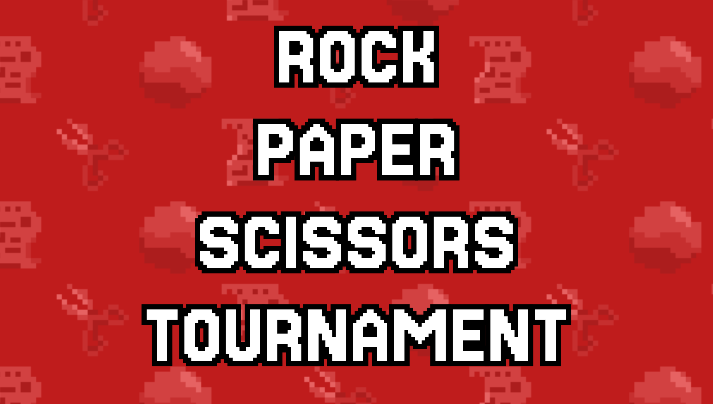

# Rock Paper Scissors (RPS) Tournament Website

## A fully functional Website for hosting a Rock Paper Scissors Tournament for your school events

RPS-Tournament is a webapp for hosting a tournament of the classic game of Rock Paper Scissors! It was made with an 8-bit retro design with aggressive red and orange colorscheme. Students will join the tournament on their phones while the hosts will operate the game using the admin page.

  

> [!IMPORTANT]
> This project is no longer being worked on. Feel free to download, use it, fork it and do whatever you want to with the code. There will be no information regarding contributions unless this project receives enough attention to warrant continued support.

### Features

- Create Players with 7-digit student IDs
- Randomly choosing two contestants to FIGHT
- Rock Paper Scissors Functionality _(obv)_
- End Game screen to show top 3 players and credit to its creators
- _More features are presented within the Frontend and API `README.md` files_

## Table of Contents

- [Installation](#installation)
- [Hosting](#hosting)
- [Usage](#usage)
- [Project Structure](#project-structure)
- [Creators](#creators)

### [API](./apps/api/README.md)

- [API Structure](./apps/api/README.md#api-structure)

### [FrontEnd](./apps/frontend/README.md)

- [Routes](./apps/frontend/README.md#routes)
- [Frontend Structure](./apps/frontend/README.md#frontend-structure)
- [Links](./apps/frontend/README.md#links)

## Installation

### 1. Download Requirements

- [npm](https://docs.npmjs.com/downloading-and-installing-node-js-and-npm)
- [git](https://git-scm.com/downloads)

### 2. Download Project

Open your Terminal application and type:

```sh
git clone https://github.com/devaine/RPS-Tournament.git
```

### 3. Install dependencies:

`cd` into downloaded directory and do the following:

```sh
npm i # npm install but lazier
```

## Hosting

### Option 1: Local Host

Run app:

```sh
npm run dev # hosts both api and frontend using turbo
```

### Option 2: Remote Host

Create a secret called `PROD_URL`. `PROD_URL` will be the url of the website you're hosting this project on (make sure to add `https://`). Follow [this guide](https://www.youtube.com/watch?v=aK6sJDOn2Hc) to learn how to create a secret.

Build the project, replace `your_tag_name` with your preferred tag:

```sh
docker buildx build --secret "id=PROD_URL" -t <your_image_name> . # builds project using your secret
```

Run your built image, (container port will always be `3003`)

```sh
docker run -p 3003:3003 <your_image_name> # runs the docker image
```

Make sure you port forwarded `3003` with your computer's IP and you should be good.

## Usage

[](https://www.youtube.com/watch?v=pilOqmKyrKA)

## Project Structure

Split between two apps:

1. [API](./apps/api/README.md#api-structure)
2. [Frontend](./apps/api/README.md#frontend-structure)

### Tech Stack

- [Typescript](https://www.typescriptlang.org/) as our primary language
- [Turbo](https://turborepo.com/) for automating frontend and API production builds

## Creators

<a href="https://github.com/devaine">

</a>
<a href="https://github.com/papatenko">

</a>
<a href="https://github.com/lancefinke">

</a>
<a href="https://github.com/AngelAJH">

</a>

**[devaine](https://github.com/devaine)** = lead backend developer

**[papatenko](https://github.com/papatenko)** = lead frontend developer

**[lancefinke](https://github.com/papatenko)** = helped with backend

**[AngelAJH](https://github.com/AngelAJH)** = created our colorful cast of profile pictures!

**Taylor Wiedeman** = created our glorious rock, paper, and scissors icons along with the animated background!
